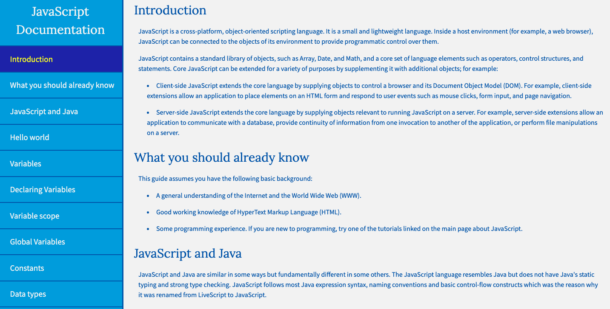

# A_Technical_Documentation_Page
This is my other web development project. I built this technical documentation page with front-end web development technologies. This project demonstrates the principles of responsive web design. I wrote a blog post about the project, you can find it on my [medium profile]().

## What I learned
* Basic HTML and HTML5
* Basic CSS
* Applied Visual Design
* Responsive Web Design Principles
* CSS Flexbox

## Technologies used
* HTML, HTML5
* CSS, CSS3, CSS Flexbox

## Setup and Run
1. Download the project files
2. Extract all files from the zipped folder
3. Open the folder
4. Open the file called "index.html"

## Screenshot of the webpage
